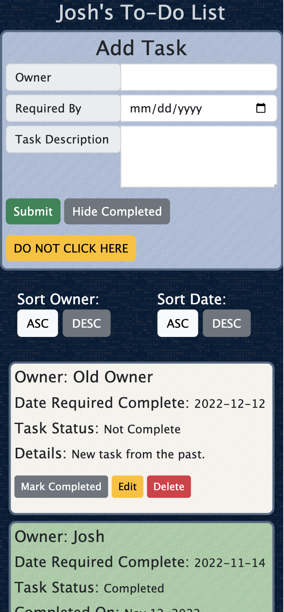

# PROJECT NAME

***Josh's To-Do List***

## Description

This application is a simple task list that allows users to record and track tasks. 

The app provide the ability to create new tasks, mark items complete, delete erroneous tasks. Tasks are sorted by oldest first. You can hide completed tasks by clicking the related button.

To see the fully functional site, please visit: [DEPLOYED VERSION OF APP](www.heroku.com)

## Screen Shot

### Prerequisites

Link to software that is required to install the app (e.g. node).

- [Node.js](https://nodejs.org/en/)
- [PostgreSQL](https://www.postgresql.org/download/)

## Installation

1. Create a database named `weekend-to-do-app`,
2. The queries in the `dabatase.sql` file are set up to create all the necessary tables and populate the needed data to allow the application to run correctly. The project is built on [Postgres](https://www.postgresql.org/download/), so you will need to make sure to have that installed. We recommend using Postico to run those queries as that was used to create the queries, 
3. Open up your editor of choice and run an `npm install`
4. Run `npm run server` in your terminal
5. Run `npm run client` in your terminal
6. The `npm run client` command will open up a new browser tab for you!
